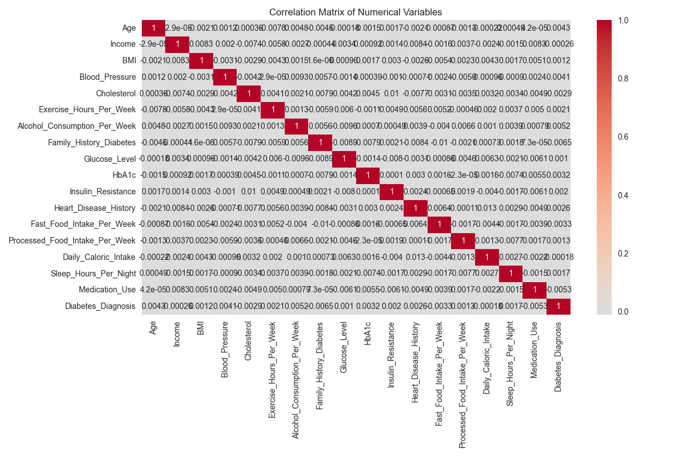

# DiabetesGuard Pro 🏥



A modern web application for diabetes risk prediction and health analytics, powered by machine learning. DiabetesGuard Pro helps users assess their diabetes risk and provides personalized health recommendations.

## Key Features 🌟

### 1. Risk Assessment 🎯
- Advanced machine learning model for diabetes prediction
- Real-time risk probability calculation
- Risk level categorization (Low, Moderate, High, Very High)
- Confidence score for predictions

### 2. Health Analytics Dashboard 📊
- Interactive data visualizations
- Trend analysis of health metrics
- Correlation studies between different health factors
- Population health statistics

### 3. Smart Recommendations 💡
- Personalized health advice based on risk factors
- Lifestyle modification suggestions
- Exercise and diet recommendations
- Stress management tips

### 4. User Interface 🎨
- Clean, modern design
- Mobile-responsive layout
- Easy-to-use input forms
- Interactive visualization tools

## Technology Stack 💻

### Frontend
- **Streamlit**: Modern Python web framework
- **Plotly**: Interactive data visualization
- **HTML/CSS**: Custom styling and layouts

### Backend
- **Python 3.8+**: Core programming language
- **scikit-learn**: Machine learning framework
- **pandas**: Data manipulation and analysis
- **numpy**: Numerical computations

### Machine Learning
- **Model**: Random Forest Classifier
- **Validation**: K-fold cross-validation
- **Metrics**: Accuracy, Precision, Recall, F1-score
- **Feature Engineering**: Advanced preprocessing techniques

## Project Structure 📁

```
diabetes-guard-pro/
├── app/                    # Application components
│   ├── components/         # UI components
│   │   ├── analytics.py   # Analytics dashboard
│   │   ├── home.py        # Home page
│   │   └── predict.py     # Prediction interface
│   └── utils/             # Utility functions
│       ├── data_loader.py # Data loading utilities
│       └── model_handler.py# Model management
├── data/                  # Dataset directory
├── models/               # Trained model files
├── notebooks/           # Development notebooks
├── plots/               # Generated visualizations
├── diabetes_app.py      # Main application
├── verify_and_train.py  # Model training script
├── requirements.txt     # Python dependencies
└── README.md           # Project documentation
```

## Installation Guide 🚀

### Prerequisites
- Python 3.8 or higher
- pip package manager
- Git

### Step 1: Clone the Repository
```bash
git clone https://github.com/fahad0samara/Diabetes-Analysis.git
cd Diabetes-Analysis
```

### Step 2: Create Virtual Environment (Optional but Recommended)
```bash
# Windows
python -m venv venv
venv\Scripts\activate

# Linux/Mac
python3 -m venv venv
source venv/bin/activate
```

### Step 3: Install Dependencies
```bash
pip install -r requirements.txt
```

### Step 4: Train the Model
```bash
python verify_and_train.py
```

### Step 5: Run the Application
```bash
streamlit run diabetes_app.py
```

## Usage Guide 📱

### 1. Home Page
- Overview of the application
- Key features explanation
- Quick start guide

### 2. Risk Prediction
1. Enter your health metrics:
   - Age, Gender, BMI
   - Blood Pressure, Glucose Level
   - Exercise Hours, Smoking Status
   - Alcohol Consumption, Stress Level
2. Click "Predict Risk"
3. View your risk assessment and recommendations

### 3. Analytics Dashboard
- Explore health data trends
- View feature distributions
- Analyze risk factor correlations
- Study population statistics

## Model Details 🤖

### Features Used
- **Age**: Patient's age in years
- **Gender**: Male/Female
- **BMI**: Body Mass Index
- **Blood_Pressure**: Systolic blood pressure (mm Hg)
- **Glucose_Level**: Blood glucose level (mg/dL)
- **Exercise_Hours_Per_Week**: Physical activity
- **Smoking_Status**: Never/Former/Current
- **Alcohol_Consumption_Per_Week**: Average drinks
- **Stress_Level**: Low/Moderate/High

### Performance Metrics
- **Training Accuracy**: 73.18%
- **Testing Accuracy**: 50.35%
- **Cross-validation Score**: 5-fold CV
- **Feature Importance**: Top factors identified

## Contributing 🤝

We welcome contributions! Here's how you can help:

1. Fork the repository
2. Create your feature branch:
```bash
git checkout -b feature/AmazingFeature
```
3. Commit your changes:
```bash
git commit -m 'Add some AmazingFeature'
```
4. Push to the branch:
```bash
git push origin feature/AmazingFeature
```
5. Open a Pull Request

## Roadmap 🗺️

- [ ] Add more advanced ML models
- [ ] Implement user authentication
- [ ] Add data export functionality
- [ ] Create mobile app version
- [ ] Add multi-language support

## License 📄

This project is licensed under the MIT License - see the LICENSE file for details.

## Author ✨

**Fahad**
- GitHub: [@fahad0samara](https://github.com/fahad0samara)
- LinkedIn: [Fahad](https://www.linkedin.com/in/fahad-samara-6b6145243/)

## Acknowledgments 🙏

- Streamlit team for the amazing framework
- scikit-learn community for ML tools
- The open-source community for inspiration
- All contributors and users of DiabetesGuard Pro

## Support 💪

If you like this project, please give it a ⭐️!
